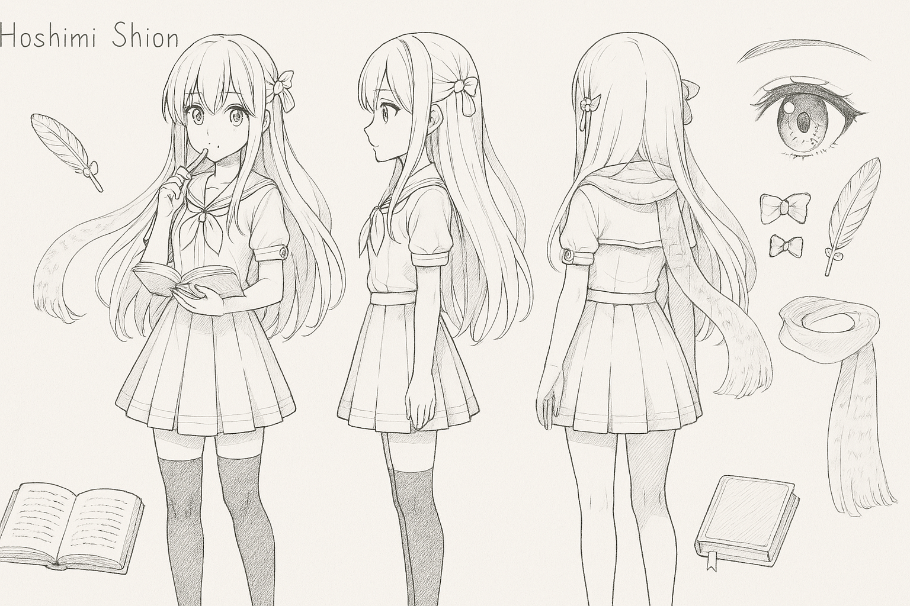

[English](README.md)
[简体中文](README.zh.md)
[日本語](README.ja.md)

# 星見書音（ほしみ しおん）

**星見書音（ほしみ しおん, Hoshimi Shion）** は **Hikarinagi** の看板娘です。

---

## 設定

- **名前**：星見書音（ほしみ しおん, Hoshimi Shion）
- **年齢**：16歳
- **身長**：156 cm
- **体重**：42 kg
- **性格**：優しくて好奇心旺盛、少し天然

書籍に深い愛情を持つ少女。静かに本を読み、ページの中の声に耳を傾ける。時折、考え込んで頭を少し傾けることも。優しい心を持ち、特に知識を求めている人々を助けることが好きです。

---

## 外見

- **髪**：長くて滑らかな白い髪、わずかな輝きがあり、左右の髪は少し短めで顔を囲むように流れる
- **アホ毛（あほげ、Ahoge）**: 頭の上に長いアホ毛があります
- **目**：明るい赤い目、魔法のような輝きがあり、無限の知識を秘めているよう
- **服装**：白と淡い青の魔法風制服、プリーツスカート、黒いオーバーニーソックス、そして本のページの文字が印刷された半透明のスカーフ

髪には金色の羽根型のブックマークヘアピンをつけ、右側には繊細な赤いリボンの蝶ネクタイをしています。

---

## 萌え要素

- **天然**：話す時、しばしば頭を軽く傾けて、とても可愛らしく見えます
- **本好き**：書音はお気に入りの言葉を小さなノートに書き留め、心に残る瞬間を記録します
- **暗闇恐怖症**：本の世界を案内する者でありながら、暗闇には少し恐れを抱いています。特に図書館の電気が消えると不安になります
- **ペン好き**：本を読んでいるとき、無意識にペンを噛んでしまい、本の世界に没頭しています

---

这个版本是完整的日语翻译，如果你需要进一步修改或其他翻译，随时告诉我！